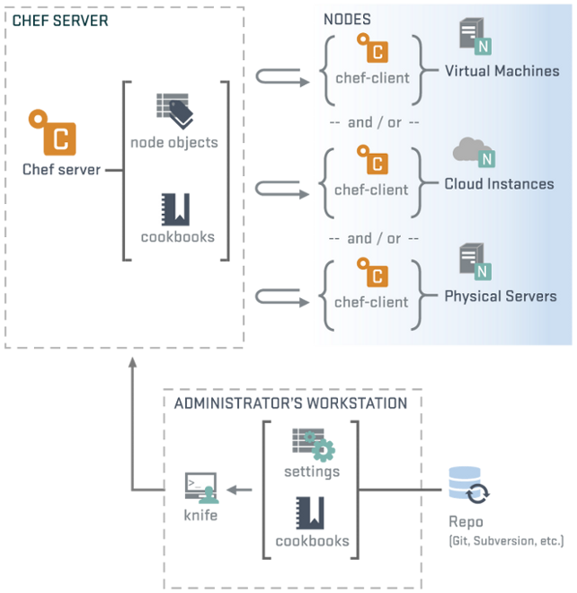

!SLIDE subsection center transition=scrollVert
# Conceptos sobre Chef

!SLIDE smbullets transition=scrollVert
# Conceptos sobre Chef

* Chef permite modelar la evolución de nuestra infraestructura y aplicaciones como si fueran código
* No impone restricciones
* Permite describir y automatizar los procesos e infraestructura
* La consecuencia es que la infraestructura se vuelve:
  * Versionable
  * Testeable
  * Replicable
* [¿Quienes lo usan?](http://www.opscode.com/customers/)

!SLIDE smbullets transition=scrollVert
# Conceptos sobre Chef
* Para lograr su objetivo se utilizan definiciones reutilizables llamadas
  **cookbooks** y **recipes**
* Los recipes se programan en Ruby
* Permiten automatizar tareas repetitivas
* Chef aplica estas definiciones en servidores produciendo así una
  infraestructura automatizada

!SLIDE smbullets transition=scrollVert
# Cookbooks y recipes
* Los cookbooks y recipes se construyen a partir de **resources**
* Chef provee una gran cantidad de resources
* Además pueden escribirse los propios
* Muchos son contribuciones de la comunidad que utiliza Chef a partir de
  cookbooks públicos

!SLIDE center transition=scrollVert
# Code CAN
[Ver video](http://www.youtube.com/embed/T8ijdOQj4ZA)

!SLIDE center transition=scrollVert
# Topología de Chef

