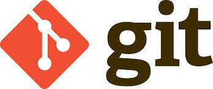

!SLIDE subsection center transition=scrollVert 

# Un poco de GIT

!SLIDE smbullets small incremental transition=scrollVert
# Introducción

* Es un **SCM** *(Source Code Management)*
* Si usabas SVN, hay que comprarse:

!SLIDE fullpage transition=scrollVert

!SLIDE commandline incremental transition=scrollVert
# Comandos básicos

	$ mkdir mi_proyecto
	$ cd mi_proyecto
	$ git init 
	Initialized empty Git repository in /xxx/mi_proyecto/.git/
	$ls -a
	.  ..  .git
	$ echo Hola > README.md
	$ git status
	 # On branch master
	 #
	 # Initial commit
	 #
	 # Untracked files:
	 #   (use "git add <file>..." to include in what will be committed)
	 #
	 #	README.md
	 nothing added to commit but untracked files present (use "git add" to track)

!SLIDE commandline incremental transition=scrollVert
# Comandos básicos
### Agregando al Staging Area y luego al repo local
	$ git add README
	$ git status
	 # On branch master
	 #
	 # Initial commit
	 #
	 # Changes to be committed:
	 #   (use "git rm --cached <file>..." to unstage)
	 #
	 #	new file:   README.md
	 #
	$ git commit -m "Importacion inicial"
	[master (root-commit) 3667c85] Importacion inicial
	 1 file changed, 1 insertion(+)
	 create mode 100644 README.md

!SLIDE commandline incremental transition=scrollVert
# Comandos básicos
### Agregando repos remotos

	$ git remote -v
	$ git remote add origin URL
	$ git remote -v
	origin URL (fetch)
	origin URL (push)
	$ git push -u <URL de remoto> <branch>

!SLIDE smbullets transition=scrollVert
# Algunos conceptos
* El **branch** por defecto es **master**
* A la URL remota donde hacemos push se lo denomina **upstream** 

!SLIDE smbullets transition=scrollVert
# Github

!SLIDE smbullets small transition=scrollVert
# Github

* Es una red social de código
* Utiliza GIT
* Cada usuario es dueño de sus repositorios
* No es posible hacer push en repositorio de otros usuarios
  * Intorduce el concepto de **fork**
  * Y el de **pull requests**
* Permite la colaboración mucho más ágil:
  * Se comentan los patch a proyectos
  * Se aceptan o no por el dueño
  * Si no lo aceptan, uso mi fork
* Pueden definirse organizaciones que agrupan usuarios y en este caso es posible
  compartir repositorios
  * [Mi espacio en Github](https://github.com/chrodriguez)
  * [El espacio de CeSPI en Github](https://github.com/Desarrollo-CeSPI)

!SLIDE smbullets transition=scrollVert
# Material de GIT

* [Try GIT](http://try.github.io/)
* [Libro de GIT](http://git-scm.com/)
* [Git branching](http://pcottle.github.io/learnGitBranching/)

