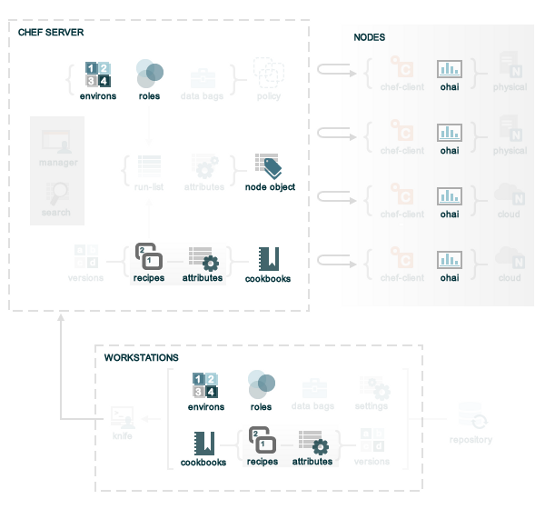

!SLIDE subsection center transition=scrollVert
# Attributes en Chef

!SLIDE bullets small transition=scrollVert

# Attributes

* Los *attributes* son un detalle específico de un nodo. Chef utiliza los attributes para entender:
  * El estado actual de un nodo
  * Cuál era el estado del nodo al finalizar la anterior corrida de Chef
  * Cuál debería de ser el estado del nodo al finalizar la corrida de Chef
* Los attributes son definidos por:
  * El estado mismo del nodo
  * Cookbooks: mediante archivos en el directorio `attributes/` y/o recipes
  * Roles
  * Environments

!SLIDE bullets small transition=scrollVert

# Attributes

* Durante cada corrida de Chef, `chef-client` arma la lista de attributes
  usando:
  * Datos recolectados de *ohai*
  * El objeto `node` guardado en Chef Server al finalizar la corrida previa
    de Chef
  * La reconstrucción del objeto `node` para la actual corrida de Chef, luego de
    actualizar cookbooks (mediante los archivos en el directorio `attributes/`
y/o recipes), roles, environments, y actualizaciones de cualquier estado en el
mismo `node` (por ejemplo ohai)

Una vez reconstruído el objeto `node`, todos los attributes son comparados y
actualizados siguiendo las reglas de precedencia.

Al finalizar la corrida de Chef, el objeto `node` que define el estado actual
del mismo es subido al Chef Server con la finalidad de indexarlo y así permitir
búsquedas.

!SLIDE smbullets small transition=scrollVert

# Attribute Types

* `default`: estos atributos son resetados al iniciar cada corrida de Chef y
  tienen la menor precedencia. Un cookbook debe crearse utilizando tantos atributos por
defecto como sea posible, sin dejar atributos sin valor.
* `force_default`: estos atributos son usados para *asegurar* que un atributo definido en un
  cookbook (mediante archivos en el directorio `attributes` y/o recipes) toma
precedencia sobre el atributo `default` definido por un *role* o *environment*
* `normal`: estos atributos son seteos que persisten en el sistema destino y
  nunca son reseteados por una corrida de Chef. Los atributos `normal` tienen
mayor precedencia que los `default`

!SLIDE smbullets small transition=scrollVert

# Attribute Types
* `override`: estos atributos son automáticamente reseteados al inicio de cada
  corrida de Chef, y tiene mayor precedencia que los atributos `default`,
`force_default` y `normal`. Son *mayormente* utilizados en recipes, pero pueden
especificarse en archivos de `attributes`, *roles* o *environments*. Un cookbook
debe utilizar este tipo de atributos *sólo cuando sea necesario*.
* `force_override`: estos atributos son usados para *asegurar* que un atributo
  definido en un cookbook (mediante archivos en el directorio `attributes` y/o recipes) toma
precedencia sobre el atributo `override` definido por un *role* o *environment*
* `automatic`: estos atributos contienen datos identificados por *Ohai* al
  inicio de cada corrida de Chef. Un atributo `automatic` no puede modificarse y
*siempre* tiene la precedencia más alta

!SLIDE transition=scrollVert

# Attribute Types

Al inicio de cada corrida de Chef, se *resetean* todos los atributos `default`, `override` y
`automatic`. 

Chef reconstruirá los atributos recolectando información de *Ohai*
al inicio de cada corrida de Chef, y atributos definidos en el cookbook, roles
y/o environments.

Los atributos `normal` *nunca son resetados*

Luego todos los atributos se mezclan y aplican al node de acuerdo a la
precedencia de atributos.

Al finalizar la corrida de Chef, todos los atributos `default`, `override` y
`automatic` desaparecen, dejando sólo la colección de atributos `normal` que
persistirán hasta la próxima corrida de Chef.

!SLIDE bullets transition=scrollVert

# Orígenes de Attributes 

* Los atributos son provistos a Chef desde los siguientes orígenes:
  * Nodes, a través de Ohai al inicio de cada corrida
  * Archivos bajo el directorio `attributes` dentro de cookbooks
  * Recipes dentro de cookbooks
  * Environments
  * Roles

!SLIDE center transition=scrollVert

# Orígenes de Attributes 

!SLIDE bullets transition=scrollVert

# Automatic (Ohai)

* Algunos valores comúnmente usados:
  * `node['platform']`
  * `node['platform_version']`
  * `node['ipaddress']`
  * `node['macaddress']`
  * `node['fqdn']`
  * `node['hostname']`
  * `node['domain']`
  * `node['recipes']`
  * `node['roles']`
  * `node['ohai_time']`

!SLIDE commandline incremental transition=scrollVert

# Automatic (Ohai)

	$ chef-shell
	chef > node[:platform]
	  => "ubuntu" 
	
	chef > node[:platform_version]
	  => "12.04" 
	
	chef > Time.at(node[:ohai_time])
	  => ...

!SLIDE smbullets transition=scrollVert

# Archivo de Attributes

* Estos archivos existe en el subdirectorio `attributes/` de un cookbook
* Cuando un cookbook es ejecutado en un nodo, los atributos contenidos en 
  todos los archivos bajo este subdirectorio son evaluados en el contexto del
  objeto *node*.
* Si están presentes, los métodos de un nodo son utilizados para setear los
  atributos del nodo. 

!SLIDE small transition=scrollVert

# Archivo de Attributes

Por ejemeplo, el cookbook *Apache* contiene un archivo de attribute llamado `default.rb` que contiene atributos como:

	@@@ ruby
	default["apache"]["dir"]          = "/etc/apache2"
	default["apache"]["listen_ports"] = [ "80","443" ]

En este ejemplo, el uso del objeto node está implícito. En el siguiente ejemplo
utiliza el objeto node:

	@@@ ruby
	node.default["apache"]["dir"]         = "/etc/apache2"
	node.default["apache"]["listen_ports"]= ["80", "443"]

!SLIDE smbullets smaller transition=scrollVert

# Precedencia de Attributes

1. Un `default` attribute ubicado en un archivo attributes
1. Un `default` attribute ubicado en un recipe 
1. Un `default` attribute ubicado en un environment
1. Un `default` attribute ubicado en un role
1. Un `force_default` attribute ubicado en un archivo attributes
1. Un `force_default` attribute ubicado en un recipe
1. Un `normal` attribute ubicado en un archivo attributes
1. Un `normal` attribute ubicado en un recipe
1. Un `override` attribute ubicado en un archivo attributes
1. Un `override` attribute ubicado en un recipe
1. Un `override` attribute ubicado en un role
1. Un `override` attribute ubicado en un environment
1. Un `force_override` attribute ubicado en un archivo attributes
1. Un `force_override` attribute ubicado en un recipe
1. Un `automatic` attribute identificado por ohai al inicio de una corrida Chef

!SLIDE transition=scrollVert

# Precedencia de Attributes
El orden de precedencia de atributos para *roles* y *environments* se invierte
para atributos `default`y `override`:

* Para `default`, el orden de precedencia es: environment, role
* Para `override`, el orden de precedencia es: role, environment

*Aplicando los atributos `override` del environment* ***luego*** *de los roles
permite que los roles existan en múltiples environments*

!SLIDE smaller transition=scrollVert

# Ejemplo de attributes

## Ejemplos ordenados de menor a mayor precedencia

Default attribute en `/attributes/default.rb`

	@@@ ruby
	default["apache"]["dir"] = "/etc/apache2"

Default attribute en `/environments/environment_name.rb`

	@@@ ruby
	default_attributes({ "apache" => {"dir" => "/etc/apache2"}})

Default attribute en `/roles/role_name.rb`

	@@@ ruby
	default_attributes({ "apache" => {"dir" => "/etc/apache2"}})

Default attribute en objeto `node` en una recipe

	@@@ ruby
	node.default["apache"]["dir"] = "/etc/apache2"

!SLIDE smaller transition=scrollVert
# Ejemplo de attributes

## Ejemplos ordenados de menor a mayor precedencia

Normal attribute seteado en un cookbook mediante `/attributes/default.rb`

	@@@ ruby
	set["apache"]["dir"] = "/etc/apache2"
	normal["apache"]["dir"] = "/etc/apache2"  
		#set alias de normal

Normal attribute seteado en un `recipe`

	@@@ ruby
	node.set["apache"]["dir"] = "/etc/apache2"
	node.normal["apache"]["dir"] = "/etc/apache2" # idem ant
	node["apache"]["dir"] = "/etc/apache2"        # idem ant

Override attribute en `/attributes/default.rb`

	@@@ ruby
	override["apache"]["dir"] = "/etc/apache2"

Override attribute en `/roles/role_name.rb`

	@@@ ruby
	override_attributes({ "apache" => {"dir" => "/etc/apache2"}})

!SLIDE smaller transition=scrollVert
# Ejemplo de attributes

## Ejemplos ordenados de menor a mayor precedencia
Override attribute en `/environments/environment_name.rb`

	@@@ ruby
	override_attributes({ "apache" => {"dir" => "/etc/apache2"}})

Override attribute en objeto `node` (de un recipe)

	@@@ ruby
	node.override["apache"]["dir"] = "/etc/apache2"

!SLIDE smaller transition=scrollVert
# Modificando la precedencia de attributes default

Cuando un default attribute es setado así:

	@@@ ruby
	default["attribute"] = "value"

cualquier valor seteado por un role o environment lo reemplazará. Para prevenir
este remplazo, podemos utilizar `force_default`:

	@@@ ruby
	force_default["attribute"] = "I will crush you, role or " +
		"environment attribute"
	
	# o es posible usar:
	
	default!["attribute"] = "The '!' means I win!"

!SLIDE smaller transition=scrollVert
# Modificando la precedencia de attributes override

Cuando un override attribute es seteado así:

	@@@ ruby
	override["attribute"] = "value"

cualquier valor seteado por un rol o environment lo reemplazará. Para prevenir
este reemplazo, podemos utilizar `force_override`:

	@@@ ruby
	force_override["attribute"] = "I will crush you, role or "+
		"environment attribute"
	
	# o es posible usar:
	
	override!["attribute"] = "The '!' means I win!"
