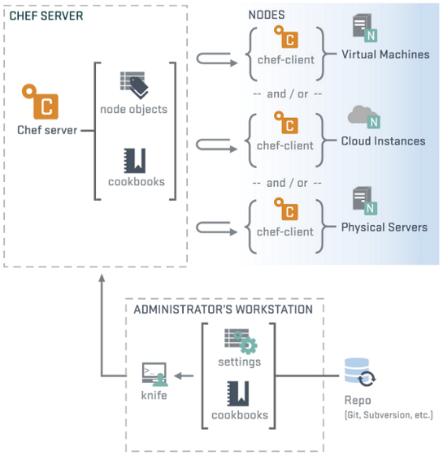

!SLIDE center subsection transition=scrollVert
# Chef en Producción

!SLIDE smbullets transition=scrollVert
# ¿A qué llamamos Chef en producción?

* Hasta ahora veníamos trabajando con cookbooks usando **chef-solo**
* Ahora vamos a trabajar con el ecosistema de chef, donde el servidor cumple un
  rol fundamental

!SLIDE transition=scrollVert
# La arquitectura de Chef

!SLIDE smbullets transition=scrollVert
# Workstations
* Es una máquina configurada para correr **knife**, preparada para:
  * Sincronizar con el repositorio de chef
  * Interactuar con un servidor de chef
* Es desde donde los usuarios de chef realizarán la mayor parte de su labor

!SLIDE smbullets transition=scrollVert
# Workstations
* Desde el workstation, los usuarios realizarán tareas como:
  * Desarrollo de cookbooks 
  * Manteniendo el repositorio de chef sincronizado con un SCM
  * Utilizando `knife` para actualizar al servidor Chef desde el repositorio de
    Chef
  * Configurando políticas organizacionales, utilizando `roles` y `ambientes`,
    así como empleando `data bags` para el almancenamiento de datos críticos

!SLIDE smbullets small transition=scrollVert
# Chef Server

* Actúa como un hub donde se mantienen datos de configuración
* Almacena: 
  * cookbooks
  * políticas que se aplicarán a los cookbooks
  * metadatos describiendo cada nodo registrado en la infraestructura
* Los nodos utilizarán `chef-client` para consultar al Chef Server sobre
  detalles de configuración
* `chef-client` realizará toda la configuración en cada nodo. *No en el Chef
  Server*
  * Este enfoque escalable destribuye el esfuerzo de configuración a lo largo de
    la organización

!SLIDE smbullets transition=scrollVert
# Nodes

* Estas entidades son las máquinas que configuraremos utilizando Chef
* Aplicarán las configuraciones corriendo `chef-client` que es como `chef-solo`
  pero obteniendo los atributtes desde Chef Server en vez de *setearlos*
manualmente en cada corrida como hacíamos con *vagrant*

