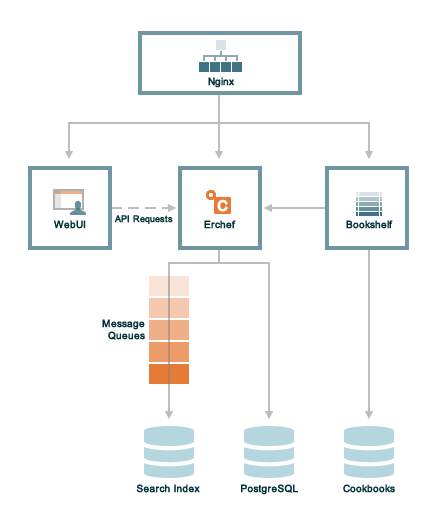
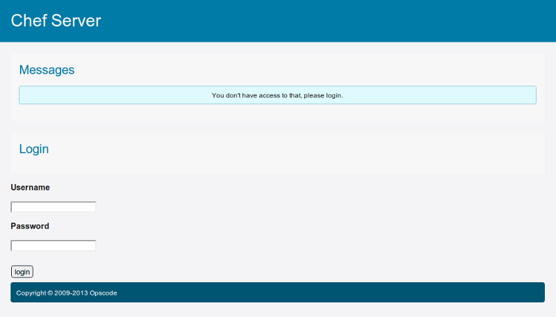
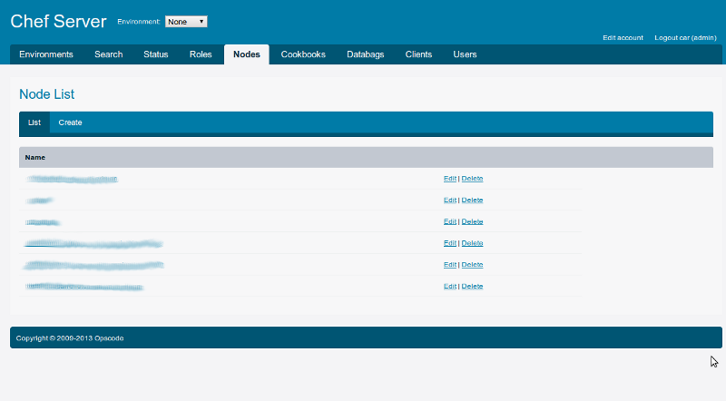

!SLIDE center subsection transition=scrollVert
# Chef Server

!SLIDE smbullets transition=scrollVert
# Historia del Chef Server

* A partir de la versión 11.x de Chef, el frontend se desarrolló con **[Earlang](http://www.erlang.org/)**
  * Lenguaje creado en 1986
  * Liberado en 1998
  * Excelente para asuntos críticos empresariales: concurrencia, tolerancia a
    fallos, ambientes distribuídos. 
* A esta componente se la suele llamar **Erchef**
  
!SLIDE smbullets transition=scrollVert
# Componentes del Chef Server

!SLIDE small smbullets transition=scrollVert
# Componentes del Chef Server

* **Bookshelf:** almacena el contenido de los cookbooks que hayan sido subidos
  al Chef Server versionados según se hayan subido. El almacenamiento de cookbooks
es manejado independientemente del Chef Server e índice de búsquedas.
* **Web UI:** es una aplicación Ruby on Rails 3.0 que hostea una aplicación de
  frontend a la API provista por Erchef
* **Erchef:** es la API central, el cerebro del Chef Server que al ser
  reimplementada en Earlang, ha mejorado notablemente su velocidad respecto de
versiones previas. La API es totalmente compatible con la versión previa
desarrollada en Ruby

!SLIDE small smbullets transition=scrollVert
# Componentes del Chef Server
* **Message Queues:** los mensajes son enviados al Search Index utilizando las
  siguientes componentes:
  * [RabbitMQ](http://www.rabbitmq.com/): Chef Server en vez de comunicarse
  directamente con el Search Index, primero lo hace con una **cola**
  * **chef-expander** es utilizado para extraer los mensajes desde las colas,
    procesarlas al formato necesario, para luego ser posteadas a **chef-solr**
  * **chef-solr** es un wrapper de [Apache Solr](http://lucene.apache.org/solr/) exponiendo su API Rest para
    indexación y búsqueda
* **[Nginx](http://nginx.org/):** reverse proxy HTTP usado como frontend load balancer
* **PostgresSQL:** base de datos usada por Chef Server

!SLIDE smbullets transition=scrollVert
# Características que provee

* **Chef Server API:** API REST que provee acceso a los objetos en Chef Server
* **Data bags:** variables globales almacenadas en formato JSON accesibles desde
  un Chef Server
* **Environments:** forma de mapear workflows de la organización en Chef Server
* **Node objects:** consiste de un `run-list` y `attributtes` del nodo, en
  formato JSON que es almacenado en Chef Server. El `chef-client` recibe una
copia desde el Chef Server durante cada corrida de Chef y luego almacena un
nuevo *node object* en Chef Server al finalizar la corrida de Chef.

!SLIDE smbullets transition=scrollVert
# Características que provee

* **Roles:** una forma de definir patrones y procesos que aplican a varios nodos
  de la organización como pertenecientes a una función o tarea determinada. Por
ejemplo web servers, mail servers, etc.
* **Search:** los índices de búsqueda permiten realizar consultas de cualquier
  tipo de dato que sea indexado por el Chef Server, incluyendo data bags,
environments, nodes y roles.

!SLIDE smbullets transition=scrollVert
# Versiones de Chef Server
* **Hosted Chef:** hosteado por Opscode. Es gratuito hasta 5 nodos. Luego de este
  límite, se cobra un monto que depende de la cantidad de nodos. Garantiza
(24x7/365), actualizaciones periódicas
* **Private Chef:** versión similar a la anterior, pero que por requerimientos de la
  organización, el Chef Server debe ubicarse detrás de un firewall
* **Open Source Chef:** versión gratuita del Chef Server, donde cada organización
  gestiona el servicio, incluyendo migraciones, backups, aplicando
actualizaciones. No incluye soporte de Opscode

!SLIDE transition=scrollVert
# Web UI Login

!SLIDE transition=scrollVert
# Web UI 

!SLIDE smbullets transition=scrollVert
# Consideraciones para instalar Chef Server
* Se siguen los pasos indicados en la página
* Se requiere ser cauteloso con **FQDN**
  * Que el comando `hostname` retorne un nombre incluyendo el *dominio*
  * Que el nombre del Chef Server sea conocido por DNS (o en ambientes de
    testing, alcanzaría con que se indique en `/etc/hosts`)

!SLIDE commandline incremental transition=scrollVert
# Instalamos Chef Server con Berkshelf

## Preparamos un directorio para Berkshelf

	$ mkdir chef-server
	$ cd chef-server
	$ berks init
	      create  Berksfile
	      create  Thorfile
	      create  .gitignore
	         run  git init from "."
	      create  Gemfile
	      create  Vagrantfile
	Successfully initialized
	$ bundle
	Fetching gem metadata from https://rubygems.org/..........
	Resolving dependencies...
	Using i18n (0.6.1) 
	Using multi_json (1.7.7) 
	...

!SLIDE transition=scrollVert
# Instalamos Chef Server con Berkshelf

## Editamos el Berksfile

	@@@ruby
	site :opscode
	
	cookbook 'chef-server'

!SLIDE commandline incremental small transition=scrollVert
# Instalamos Chef Server con Berkshelf

## Verificamos los cookbooks
	$ berks
	Installing chef-server (2.0.0) from site: 'http://cookbooks.opscode.com/api/v1/cookbooks'
	Using runit (0.16.2)
	Using bluepill (2.2.0)
	Using rsyslog (1.5.0)
	Using daemontools (1.0.0)
	Using build-essential (1.3.2)
	Using ucspi-tcp (1.0.0)
	Using couchdb (2.1.0)
	Using erlang (1.1.2)
	Using yum (2.1.0)
	Using apache2 (1.4.0)
	Using nginx (1.2.0)
	Using ohai (1.1.6)
	Using openssl (1.0.0)
	Using zlib (2.0.0)
	Using xml (1.1.2)
	Using java (1.9.4)
	Using windows (1.8.2)
	Using chef_handler (1.1.4)
	Using gecode (2.0.0)
	Using apt (2.0.0)

*Si fuese necesario correr* `berks update`
!SLIDE commandline incremental transition=scrollVert
# Instalamos Chef Server con Berkshelf

## `vagrant up` y Listo!!

	$ vagrant up

!SLIDE transition=scrollVert
# Probamos Chef Server con Berkshelf

Como Chef Server requiere el **FQDN**, debemos agregar en el `/etc/hosts` una 
entrada para la ip que hayamos dado a vagrant en nuestra máquina con el nombre:
`chef-server-berkshelf`

!SLIDE commandline incremental transition=scrollVert
# Descargar el ejemplo
## Para descargar el ejemplo dado

	$ git clone https://github.com/chrodriguez/capacitacion_chef.git
	$ cd capacitacion_chef·
	$ cd samples/02-chef-prod/chef-server

